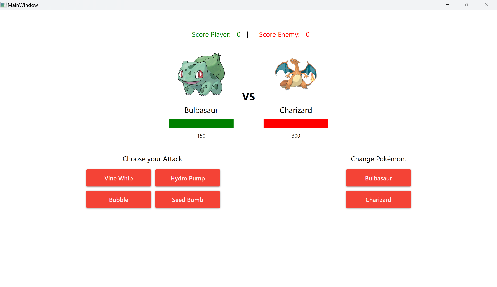

# GroupieTracker 🪢

Welcome to Pokémon C# ! This project is an application based on pokemon fight.



# Prerequisite ⏪

Somes knowledges in this field : 

- The use of C# 
- The use of WPF
- The use of SQL server
- The use of Git and for the code management

# Installation 🔧

1. Clone the repository.
```bash
  git clone https://github.com/MounKilian/PokemonCSharp.git
```
2. Reach in the repository.
```bash
  cd pokemon
```

# Start 🧑‍💻

1. Open pokemon.sln file

2. Press Ctrl + F5 or click on execute button to start the application

3. Enjoy !

# How Play ? 🔨

Its better to play with the entire window !

You arrive on the init page. You have 3 pages : 
- Settings (set the database link)
- Log In
- Sign In
On the Settings Page you have to set your own link of your database for example : 
```bash
  Server=DESKTOP-3UFAEVB\SQLEXPRESS;Database=ExerciceMonster;Trusted_Connection=True;TrustServerCertificate=True;
```

Then there are 3 different pages again:
- Game
- Pokemons
- Spells

In Game page you can choose 2 pokémons for each players and then initialize the fight

In the pokémons page you can see all pokémons you have and their features. You can also see all spells the pokemons have.

In the spells page you can see all spells you have and their features. You can also filter all spell by pokemon.

When you have initialize a fight you can use spells or change pokémons. The ennemy can attack you with a random spell of his spells. If you kill the first ennemy the second one have a boost dammage and health.

You can see a scoreboard during the game of each kill made.

Finally when u have finish to fight you can come back on the menu or replay.

# Version 🗃️

.NET 8.0

# Authors 💸

 - [Kilian Moun 🍻](https://github.com/MounKilian)
